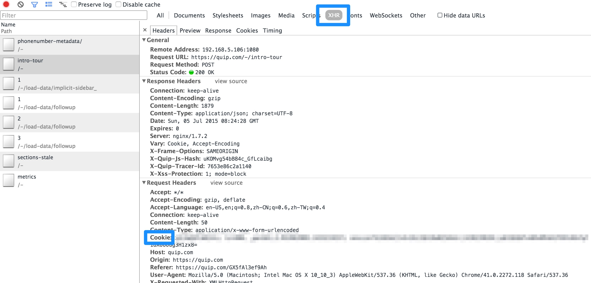

# Fix Quip Markdown Export

Quip doesn't export proper markdown for images:

```
An image:

[Image: https://quip.com/-/blob/aAfAAAIWp2R/IoYZ1WSAYYqRi7PzeCUYdQ]

Another image:

[Image: https://quip.com/-/blob/aAfAAAIWp2R/8IQI3dfXXmFiax0BuF_tUg]
```

Furthermore, these links are only accessible with an authenticated browser session.

`quip-normalize` uses the cookies from an existing browser session to fetch all these images, then rewrite `[Image: remote-image]` as local image tags ``

# Install

```
go install github.com/hayeah/quiptool/quip-normalize
```

# Usage

First, get the quip cookie:



Then normalize:

```
# QUIP_COOKIE
export QUIP_COOKIE="your-cookie"
quip-normalize quip-export.md > normalized.md
```

`quip-normalize` does a few things:

+ Downloads all images to the input file's directory.
+ Outputs normalized markdown to stdout.
+ Saves all downloaded files in `quip-assets.json`.